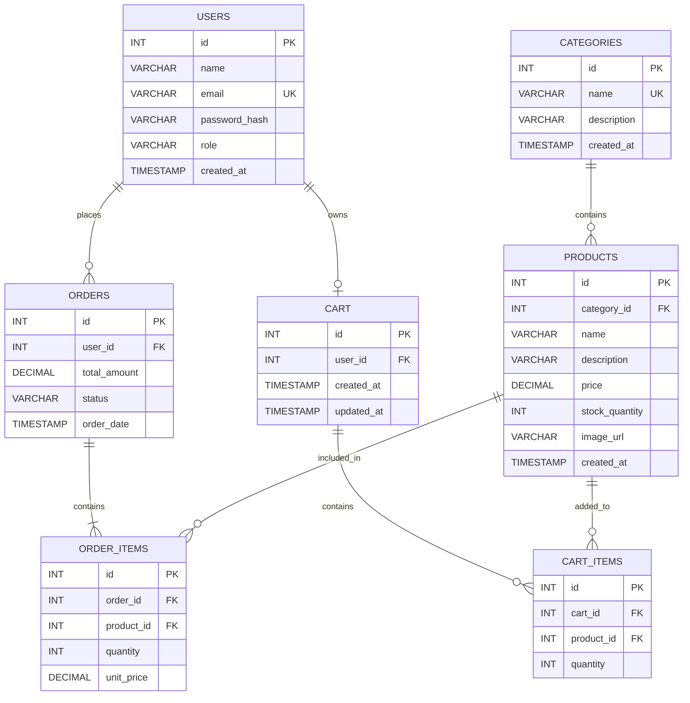

# Sprint 1: System Architecture & Scope Definition

## Project: StyleCart — Online Fashion & Accessories Store

**Course:** E-Commerce
**Roll Number:** 2K23-CSM-35
**Sprint:** 1 — Architecture & Scope Definition
**Project Type:** Individual E-Commerce Project
**Domain:** Fashion & Accessories

---

# 1. Target Audience & Market Focus

## 1.1 Primary Persona

**Persona Name:** Online Fashion Shopper

**Age Group:** 18–35 years

**Target Users:**

* Students
* Young adults
* Working professionals
* General online shoppers
* People purchasing fashion products or gifts

**Goals:**

* Find fashion products easily
* Browse products by category
* Search and filter products
* Add products to a shopping cart
* Place orders online
* View previous orders

**Technical Level:** Basic to intermediate

## 1.2 Core Pain Point

Customers often need to visit multiple websites or physical stores to find suitable fashion and accessory products. This can make product searching and purchasing inconvenient and time-consuming.

StyleCart addresses this problem by providing a single online platform where customers can browse fashion products, manage their cart, and place orders.

## 1.3 Domain Scope

StyleCart focuses on online fashion and accessories.

### Product Categories

* Clothing
* Shoes
* Bags
* Watches
* Jewelry
* Fashion Accessories

### Features Outside the Initial Scope

The following advanced features are not included in the Sprint 1 MVP:

* AI-based product recommendations
* Live delivery tracking
* Loyalty and reward programs
* Multi-vendor marketplace
* Advanced business analytics

---

# 2. MVP Feature Scope

The Minimum Viable Product (MVP) contains the following primary workflows:

| Category       | Feature Name                   | Description                                                                  | Priority   |
| -------------- | ------------------------------ | ---------------------------------------------------------------------------- | ---------- |
| Authentication | User Registration & Login      | Customers can create accounts and securely log in using email and password.  | High (MVP) |
| Catalog        | Product List & Search          | Users can browse, search, and filter fashion products by category.           | High (MVP) |
| Cart           | Cart Management                | Users can add products to the cart, update quantities, and remove products.  | High (MVP) |
| Checkout       | Order Processing               | Users can review their cart and place an order using a mock payment process. | High (MVP) |
| Admin          | Product & Inventory Management | Admin can add, update, delete products and manage stock quantities.          | Medium     |
| Orders         | Order History                  | Customers can view their previous orders and order status.                   | Medium     |

## 2.1 Customer Workflow

```text
Register / Login
       ↓
Browse Products
       ↓
Search / Filter
       ↓
Add to Cart
       ↓
Review Cart
       ↓
Checkout
       ↓
Place Order
       ↓
View Order History
```

## 2.2 Admin Workflow

```text
Admin Login
     ↓
Manage Categories
     ↓
Manage Products
     ↓
Update Inventory
     ↓
View Orders
```

---

# 3. Tech Stack Selection & Justification

## 3.1 Frontend — React.js

React.js will be used to develop the user interface of StyleCart. It supports reusable components and dynamic page updates, making it suitable for product listings, shopping cart management, checkout, and admin screens.

## 3.2 Backend — Node.js + Express.js

Node.js with Express.js will be used to develop the server-side application and REST APIs. It will handle authentication, product operations, cart management, order processing, and communication with the database.

## 3.3 Database — MySQL

MySQL will be used as the primary relational database for storing users, categories, products, orders, order items, carts, and cart items. Its relational structure is suitable for maintaining relationships between customers, products, and orders.

## 3.4 Optional Caching — Redis

Redis may be used as an optional caching layer to improve performance for frequently requested data such as product listings or categories. It is not required for the initial MVP and can be introduced if performance optimization is needed.

## 3.5 Version Control — Git & GitHub

Git will be used for source-code version control, while GitHub will be used to store and submit the project repository. This will also make it easier to track changes throughout the six development sprints.

---

# 4. Entity Relationship Diagram (ERD)

The StyleCart database consists of the following main entities:

* Users
* Categories
* Products
* Orders
* Order_Items
* Cart
* Cart_Items

## 4.1 ERD — Mermaid Diagram



## 4.2 Relationship Explanation

### Users → Orders

**Relationship:** 1:N

One user can place multiple orders, while each order belongs to one user.

### Users → Cart

**Relationship:** 1:1

A user can have zero or one active shopping cart. The `user_id` in the Cart table should be unique to maintain this relationship.

### Categories → Products

**Relationship:** 1:N

One category can contain many products, while each product belongs to one category.

### Orders → Order_Items

**Relationship:** 1:N

One order contains one or more order items. Each order item belongs to one order.

### Products → Order_Items

**Relationship:** 1:N

One product can appear in multiple order items belonging to different orders.

### Orders ↔ Products

**Relationship:** N:M

An order can contain multiple products, and a product can appear in multiple orders. This many-to-many relationship is resolved using the `ORDER_ITEMS` table.

### Cart → Cart_Items

**Relationship:** 1:N

One cart can contain multiple cart items, while each cart item belongs to one cart.

### Products → Cart_Items

**Relationship:** 1:N

One product can appear in multiple users' carts.

### Cart ↔ Products

**Relationship:** N:M

A cart can contain multiple products, and a product can exist in multiple carts. This many-to-many relationship is resolved using the `CART_ITEMS` table.

---

# 4.3 Database Attributes and Data Types

| Entity      | Attribute      | Data Type | Key / Constraint |
| ----------- | -------------- | --------- | ---------------- |
| Users       | id             | INT       | PK               |
| Users       | name           | VARCHAR   | NOT NULL         |
| Users       | email          | VARCHAR   | UNIQUE, NOT NULL |
| Users       | password_hash  | VARCHAR   | NOT NULL         |
| Users       | role           | VARCHAR   | NOT NULL         |
| Users       | created_at     | TIMESTAMP | NOT NULL         |
| Categories  | id             | INT       | PK               |
| Categories  | name           | VARCHAR   | UNIQUE, NOT NULL |
| Categories  | description    | VARCHAR   | Optional         |
| Categories  | created_at     | TIMESTAMP | NOT NULL         |
| Products    | id             | INT       | PK               |
| Products    | category_id    | INT       | FK               |
| Products    | name           | VARCHAR   | NOT NULL         |
| Products    | description    | VARCHAR   | Optional         |
| Products    | price          | DECIMAL   | NOT NULL         |
| Products    | stock_quantity | INT       | NOT NULL         |
| Products    | image_url      | VARCHAR   | Optional         |
| Products    | created_at     | TIMESTAMP | NOT NULL         |
| Orders      | id             | INT       | PK               |
| Orders      | user_id        | INT       | FK               |
| Orders      | total_amount   | DECIMAL   | NOT NULL         |
| Orders      | status         | VARCHAR   | NOT NULL         |
| Orders      | order_date     | TIMESTAMP | NOT NULL         |
| Order_Items | id             | INT       | PK               |
| Order_Items | order_id       | INT       | FK               |
| Order_Items | product_id     | INT       | FK               |
| Order_Items | quantity       | INT       | NOT NULL         |
| Order_Items | unit_price     | DECIMAL   | NOT NULL         |
| Cart        | id             | INT       | PK               |
| Cart        | user_id        | INT       | FK, UNIQUE       |
| Cart        | created_at     | TIMESTAMP | NOT NULL         |
| Cart        | updated_at     | TIMESTAMP | NOT NULL         |
| Cart_Items  | id             | INT       | PK               |
| Cart_Items  | cart_id        | INT       | FK               |
| Cart_Items  | product_id     | INT       | FK               |
| Cart_Items  | quantity       | INT       | NOT NULL         |

---

# 5. Scope Boundaries

## Included in Sprint 1 / MVP

* User registration and login
* Product catalog
* Product search and filtering
* Shopping cart
* Checkout and order placement
* Order history
* Basic admin product management
* Basic inventory management
* Relational MySQL database design

## Excluded from Initial MVP

* AI product recommendation system
* Live delivery tracking
* Multi-vendor marketplace
* Loyalty and reward system
* Advanced analytics
* Real payment gateway integration

These features can be considered for future development if time and project requirements allow.

---

# 6. Conclusion

Sprint 1 defines the architecture, target audience, MVP scope, technology stack, and database structure of StyleCart.

The proposed architecture provides a clear foundation for the remaining development sprints. React.js will provide the frontend interface, Node.js and Express.js will handle backend services, and MySQL will manage the core relational data.

The ERD defines the required relationships between users, products, categories, carts, and orders, making the database structure suitable for an online fashion and accessories store.

---

# Repository Structure

```text
e-commerce-2k23-csm-35/
│
├── docs/
│   └── SPRINT_1.md
│
└── README.md
```
