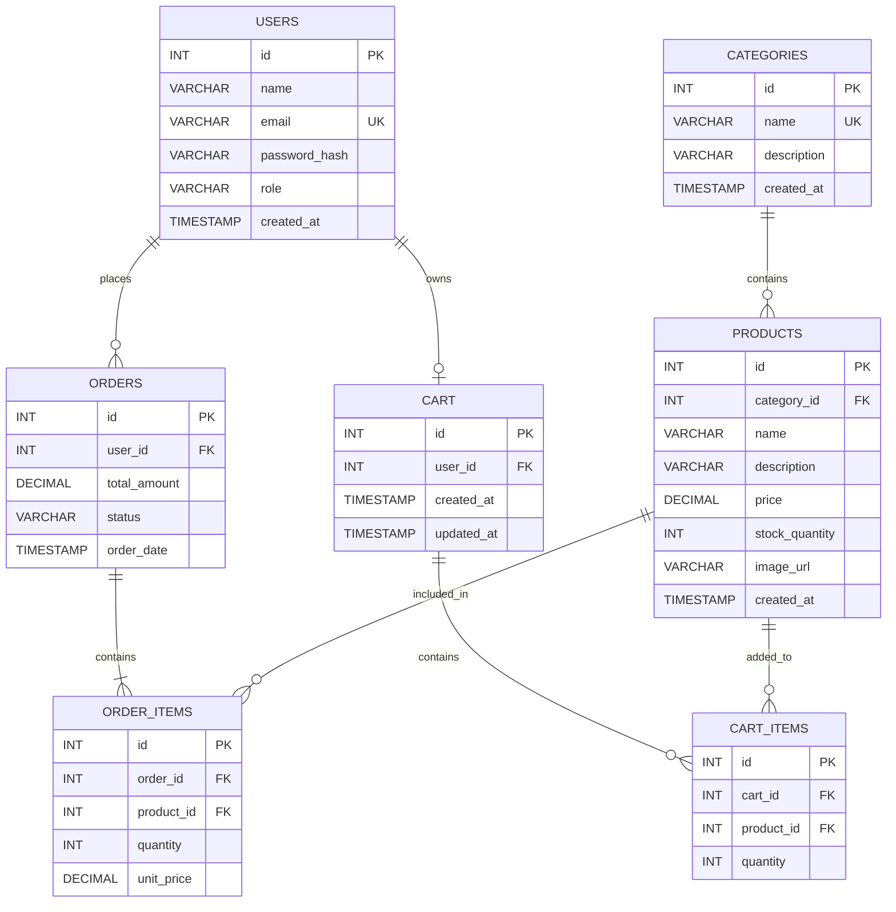

# Sprint 1: System Architecture & Scope Definition

## Project: StyleCart — Online Fashion & Accessories Store

**Course:** E-Commerce
**Sprint:** 1 — Architecture & Scope Definition
**Project Type:** Individual E-Commerce Project
**Domain:** Fashion & Accessories

---

# 1. Target Audience & Market Focus

## 1.1 Primary Persona

StyleCart is an online fashion and accessories store designed for **students, young adults, and general online shoppers** who want to purchase fashion products conveniently through an online platform.

The platform allows customers to browse products, search and filter products by category, add products to a shopping cart, place orders, and view their order history. An administrator manages products, categories, inventory, and orders.

### User Persona

**Persona:** Online Fashion Shopper

* **Age Group:** 18–35 years
* **User Type:** Students, young adults, professionals, and gift buyers
* **Goal:** Find and purchase fashion products easily online
* **Needs:** Simple product browsing, search and filtering, clear product information, easy cart management, and convenient ordering
* **Technical Level:** Basic to intermediate

---

## 1.2 Core Pain Point

Customers may need to visit multiple physical stores or websites to find different fashion products and accessories. This can make product searching, checking availability, comparing options, and placing orders inconvenient.

StyleCart addresses this problem by providing a **single online platform where customers can browse, search, select, and order fashion products and accessories conveniently**.

---

## 1.3 Domain Scope

StyleCart operates in the **Fashion and Accessories E-Commerce** domain.

The initial product catalog will include:

* Clothing
* Shoes
* Bags
* Watches
* Jewelry
* Fashion Accessories

The system will focus on the core online shopping process, including product browsing, product search, category filtering, shopping cart management, checkout, order placement, and basic inventory management.

Advanced features such as AI-based recommendations, live delivery tracking, loyalty programs, multi-vendor selling, and advanced analytics are outside the initial MVP scope.

---

# 2. Minimum Viable Product (MVP) Feature Scope

The Minimum Viable Product (MVP) contains the essential features required to demonstrate a functional online fashion and accessories store.

| Category       | Feature Name                   | Description                                                                                                                 | Priority   |
| -------------- | ------------------------------ | --------------------------------------------------------------------------------------------------------------------------- | ---------- |
| Authentication | User Registration & Login      | Allows customers to create an account and securely log in to StyleCart. Passwords are stored using secure password hashing. | High (MVP) |
| Catalog        | Product List & Search          | Allows customers to browse products and search or filter products by category.                                              | High (MVP) |
| Cart           | Cart Management                | Allows customers to add products to the cart, update quantities, and remove products.                                       | High (MVP) |
| Checkout       | Order Processing               | Allows customers to review their cart and place an order. A mock payment process can be used for the academic MVP.          | High (MVP) |
| Admin          | Product & Inventory Management | Allows the administrator to add, update, delete, and manage product information and stock quantities.                       | Medium     |
| Orders         | Order History                  | Allows logged-in customers to view their previous orders and order status.                                                  | Medium     |

## 2.1 Customer Workflow

The main customer workflow is:

**Register/Login → Browse Products → Search/Filter → Add to Cart → Review Cart → Checkout → Place Order → View Order History**

## 2.2 Administrator Workflow

The main administrator workflow is:

**Admin Login → Manage Categories → Manage Products → Update Inventory → View Orders**

The MVP is intentionally limited to the core shopping workflow so that it remains practical and achievable within the academic semester.

---

# 3. Tech Stack Selection & Justification

## 3.1 Frontend Framework: React.js

React.js will be used to develop the StyleCart frontend.

React provides a component-based architecture that supports reusable components such as product cards, navigation bars, product lists, shopping carts, and forms. Compared with developing the interface using only traditional HTML and JavaScript, React provides better support for dynamic user interactions and client-side state management.

---

## 3.2 Backend Infrastructure: Node.js with Express.js

Node.js with Express.js will be used for backend development and REST API implementation.

Node.js is suitable for an E-Commerce application because it can handle multiple client requests efficiently and provides a large ecosystem of web development packages. Express.js provides a lightweight and straightforward structure for implementing APIs and business logic, making it suitable for an academic project while allowing future scalability.

---

## 3.3 Database Management System: MySQL

MySQL will be used as the relational database management system for StyleCart.

An E-Commerce application contains strongly related data such as users, products, categories, carts, orders, and order items. MySQL is suitable because it supports primary keys, foreign keys, relationships, and transactions, helping maintain data integrity. A relational database is preferred over a NoSQL database because the entities in StyleCart have clearly defined relationships.

---

## 3.4 Caching & Asynchronous Processing: Redis (Optional)

Redis may be introduced in a later stage if caching or temporary session-related data is required.

Redis provides fast in-memory data access and can be useful for caching frequently requested information. However, Redis is optional and is **not required for the initial MVP**, since the core StyleCart system can operate using React, Node.js/Express, and MySQL.

---

## 3.5 Selected Technology Stack

| Layer           | Technology           | Purpose                                     |
| --------------- | -------------------- | ------------------------------------------- |
| Frontend        | React.js             | User interface and client-side interactions |
| Backend         | Node.js + Express.js | REST APIs and application business logic    |
| Database        | MySQL                | Relational and persistent data storage      |
| Optional Cache  | Redis                | Caching and temporary data                  |
| Version Control | Git + GitHub         | Source code and sprint management           |

---

# 4. Entity-Relationship Diagram (ERD)

The StyleCart database uses a relational structure to store users, products, categories, orders, shopping carts, and related items.

The database contains the following required entities:

1. **Users** — Stores customer and administrator accounts.
2. **Categories** — Stores product categories.
3. **Products** — Stores product details and inventory information.
4. **Orders** — Stores orders placed by customers.
5. **Order_Items** — Associative entity connecting orders and products.
6. **Cart** — Stores the active shopping cart of a user.
7. **Cart_Items** — Associative entity connecting carts and products.

---

## 4.1 ERD Relationships and Cardinality

### Users → Orders

A user can place **zero or many orders**, while each order belongs to **exactly one user**.

**Cardinality: 1:N**

### Categories → Products

A category can contain **zero or many products**, while each product belongs to **exactly one category**.

**Cardinality: 1:N**

### Orders → Order_Items

An order contains **one or many order items**, while each order item belongs to **exactly one order**.

**Cardinality: 1:N**

### Products → Order_Items

A product can appear in **zero or many order items**, while each order item refers to **exactly one product**.

**Cardinality: 1:N**

Therefore, Orders and Products have an indirect **N:M relationship**, resolved through the `ORDER_ITEMS` associative entity.

### Users → Cart

Each user can have **zero or one active cart**, and each cart belongs to **exactly one user**.

**Cardinality: 1:1**

### Cart → Cart_Items

A cart can contain **zero or many cart items**, while each cart item belongs to **exactly one cart**.

**Cardinality: 1:N**

### Products → Cart_Items

A product can appear in **zero or many cart items**, while each cart item refers to **exactly one product**.

**Cardinality: 1:N**

Therefore, Cart and Products have an indirect **N:M relationship**, resolved through the `CART_ITEMS` associative entity.

---

## 4.2 Mermaid ERD

The following Mermaid diagram represents the relational database structure of StyleCart, including primary keys, foreign keys, attributes, and relationship cardinalities.



---

## 4.3 Key Definitions

### Primary Keys (PK)

Each entity has a unique primary key:

* `USERS.id`
* `CATEGORIES.id`
* `PRODUCTS.id`
* `ORDERS.id`
* `ORDER_ITEMS.id`
* `CART.id`
* `CART_ITEMS.id`

### Foreign Keys (FK)

The foreign keys establish relationships between entities:

* `PRODUCTS.category_id` → `CATEGORIES.id`
* `ORDERS.user_id` → `USERS.id`
* `ORDER_ITEMS.order_id` → `ORDERS.id`
* `ORDER_ITEMS.product_id` → `PRODUCTS.id`
* `CART.user_id` → `USERS.id`
* `CART_ITEMS.cart_id` → `CART.id`
* `CART_ITEMS.product_id` → `PRODUCTS.id`

---

## 4.4 Attribute and Data Type Definitions

| Entity      | Attribute      | Data Type     | Key / Constraint |
| ----------- | -------------- | ------------- | ---------------- |
| Users       | id             | INT           | PK               |
| Users       | name           | VARCHAR(100)  | NOT NULL         |
| Users       | email          | VARCHAR(150)  | UNIQUE           |
| Users       | password_hash  | VARCHAR(255)  | NOT NULL         |
| Users       | role           | VARCHAR(20)   | NOT NULL         |
| Users       | created_at     | TIMESTAMP     | —                |
| Categories  | id             | INT           | PK               |
| Categories  | name           | VARCHAR(100)  | UNIQUE           |
| Categories  | description    | VARCHAR(255)  | —                |
| Categories  | created_at     | TIMESTAMP     | —                |
| Products    | id             | INT           | PK               |
| Products    | category_id    | INT           | FK               |
| Products    | name           | VARCHAR(150)  | NOT NULL         |
| Products    | description    | VARCHAR(500)  | —                |
| Products    | price          | DECIMAL(10,2) | NOT NULL         |
| Products    | stock_quantity | INT           | NOT NULL         |
| Products    | image_url      | VARCHAR(255)  | —                |
| Products    | created_at     | TIMESTAMP     | —                |
| Orders      | id             | INT           | PK               |
| Orders      | user_id        | INT           | FK               |
| Orders      | total_amount   | DECIMAL(10,2) | NOT NULL         |
| Orders      | status         | VARCHAR(30)   | NOT NULL         |
| Orders      | order_date     | TIMESTAMP     | —                |
| Order_Items | id             | INT           | PK               |
| Order_Items | order_id       | INT           | FK               |
| Order_Items | product_id     | INT           | FK               |
| Order_Items | quantity       | INT           | NOT NULL         |
| Order_Items | unit_price     | DECIMAL(10,2) | NOT NULL         |
| Cart        | id             | INT           | PK               |
| Cart        | user_id        | INT           | FK, UNIQUE       |
| Cart        | created_at     | TIMESTAMP     | —                |
| Cart        | updated_at     | TIMESTAMP     | —                |
| Cart_Items  | id             | INT           | PK               |
| Cart_Items  | cart_id        | INT           | FK               |
| Cart_Items  | product_id     | INT           | FK               |
| Cart_Items  | quantity       | INT           | NOT NULL         |

---

# 5. Scope Boundaries

To maintain a realistic and achievable academic scope, the following features are included in the initial MVP.

## 5.1 Included in MVP

* User registration and login
* Secure password storage
* Product browsing
* Product search
* Category-based filtering
* Shopping cart
* Add, update, and remove cart items
* Checkout
* Order placement
* Order history
* Basic product management for administrators
* Inventory/stock management
* MySQL database

## 5.2 Outside the Initial MVP

The following advanced features are intentionally excluded from the initial scope:

* AI-based product recommendations
* Live delivery tracking
* Multi-vendor marketplace
* Loyalty and reward programs
* Advanced business analytics
* Real online payment processing
* International shipping management
* Social media integration

These features can be considered for future versions if sufficient development time is available.

---

# 6. Sprint 1 Conclusion

Sprint 1 establishes the architectural foundation of **StyleCart — Online Fashion & Accessories Store**.

The target audience, core customer problem, market domain, MVP features, technology stack, and relational database structure have been defined. The proposed architecture focuses on simplicity, maintainability, data integrity, and feasibility within the academic semester.

The defined architecture provides a clear foundation for future sprints, where the frontend interface, backend APIs, database operations, authentication, product catalog, shopping cart, checkout, and order management can be implemented.

---

## Repository Structure

The Sprint 1 document will be stored in the project repository using the following structure:

```text
ecommerce-35/
│
├── docs/
│   └── SPRINT_1.md
│
└── README.md
```

The `SPRINT_1.md` file will serve as the architectural and scope baseline for the upcoming development sprints.
