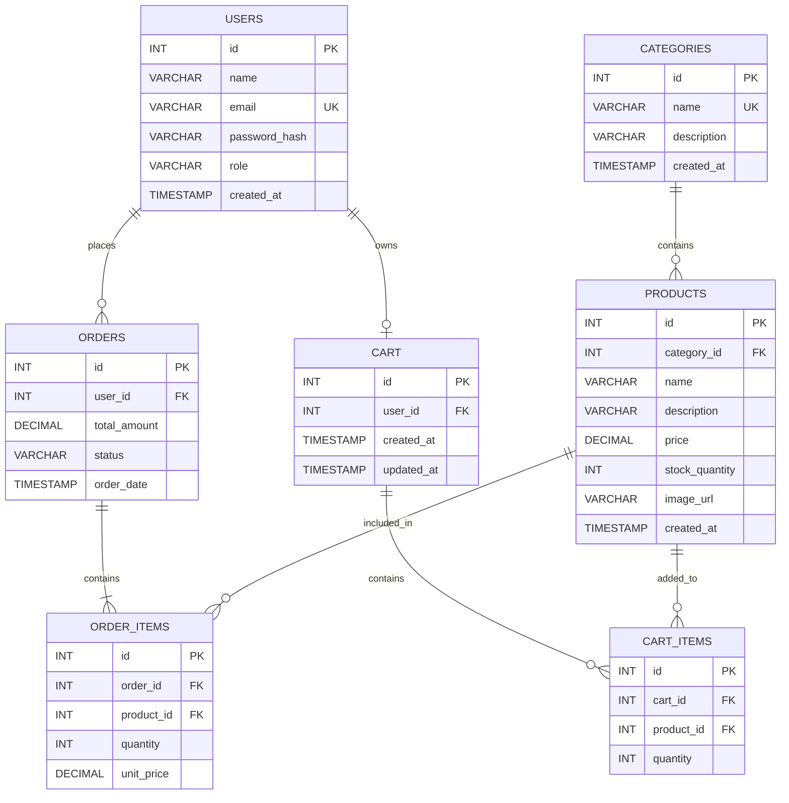

# Sprint 1: System Architecture & Scope Definition

## Project: StyleCart — Online Fashion & Accessories Store

**Course:** E-Commerce
**Roll Number:** 2K23-CSM-35
**Sprint:** 1 — Architecture & Scope Definition
**Project Type:** Individual E-Commerce Project
**Domain:** Fashion & Accessories

---

# 1. Target Audience & Market Focus

## 1.1 Primary Persona

**Persona Name:** General Online Fashion Shopper

**Age Group:** All age groups

**Target Users:**

* Children and teenagers
* Young adults
* Adults
* Older customers
* General online shoppers
* Customers buying fashion products for themselves or as gifts

**Goals:**

* Find fashion products easily
* Browse products by category
* Search for specific products
* Filter products according to their needs
* Add products to a shopping cart
* Place orders online
* View previous orders

**Technical Level:** Basic to intermediate

## 1.2 Core Pain Point

Customers may need to visit different physical stores or websites to find clothing, shoes, bags, watches, jewelry, and other fashion accessories. Searching across multiple platforms can be inconvenient and time-consuming.

StyleCart provides a single online platform where customers can browse different fashion and accessory products, manage their shopping cart, place orders, and view their order history.

## 1.3 Market Focus

StyleCart focuses on customers who prefer convenient online shopping for fashion and accessories. The platform is designed as a general fashion store rather than targeting only one specific age group or fashion category.

## 1.4 Domain Scope

StyleCart covers the following product categories:

* Clothing
* Shoes
* Bags
* Watches
* Jewelry
* Fashion Accessories

### Features Outside the Initial Scope

The following advanced features are outside the initial MVP:

* AI-based product recommendations
* Live delivery tracking
* Loyalty and reward programs
* Multi-vendor marketplace
* Advanced business analytics
* Real payment gateway integration

---

# 2. MVP Feature Scope

The Minimum Viable Product (MVP) focuses on the main activities required for a basic online fashion store.

| Category       | Feature Name                   | Description                                                                                   | Priority   |
| -------------- | ------------------------------ | --------------------------------------------------------------------------------------------- | ---------- |
| Authentication | User Registration & Login      | Customers can create an account and securely log in using their email and password.           | High (MVP) |
| Catalog        | Product Browsing & Search      | Customers can browse products and search for products by name or category.                    | High (MVP) |
| Cart           | Shopping Cart Management       | Customers can add products, update quantities, and remove products from the cart.             | High (MVP) |
| Checkout       | Order Placement                | Customers can review their cart details and place an order through a simple checkout process. | High (MVP) |
| Admin          | Product & Inventory Management | Admin can add, update, delete products and manage available stock.                            | Medium     |
| Orders         | Order History                  | Customers can view their previous orders and their basic order status.                        | Medium     |

## 2.1 Customer Workflow

```text
Register / Login
       ↓
Browse Products
       ↓
Search / Filter
       ↓
Add to Cart
       ↓
Review Cart
       ↓
Checkout
       ↓
Place Order
       ↓
View Order History
```

## 2.2 Admin Workflow

```text
Admin Login
     ↓
Manage Categories
     ↓
Manage Products
     ↓
Manage Inventory
     ↓
View Orders
```

---

# 3. Tech Stack Selection & Justification

## 3.1 Frontend — React.js

React.js will be used to build the frontend interface of StyleCart. It supports reusable components and dynamic updates, which are useful for product listings, search, cart management, checkout, and admin pages.

## 3.2 Backend — Node.js + Express.js

Node.js with Express.js will be used to develop the backend and REST APIs. The backend will handle authentication, product management, cart operations, order processing, and communication with the database.

## 3.3 Database — MySQL

MySQL will be used as the primary relational database. It is suitable for storing structured information such as users, categories, products, carts, orders, and order items while maintaining relationships between these entities.

## 3.4 Optional Caching — Redis

Redis can optionally be used to cache frequently accessed information such as product categories or product listings. It is not required for the initial MVP but can be added later if performance improvements are needed.

## 3.5 Version Control — Git & GitHub

Git will be used to track changes in the project source code, while GitHub will be used to store and submit the project repository. Version control will also help maintain the project throughout the six development sprints.

---

# 4. Entity Relationship Diagram (ERD)

The StyleCart database contains the following main entities:

* Users
* Categories
* Products
* Orders
* Order_Items
* Cart
* Cart_Items

## 4.1 ERD — Mermaid Diagram



## 4.2 ERD Relationship Explanation

### Users → Orders — 1:N

One user can place many orders, but each order belongs to one user.

### Users → Cart — 1:1

A user can have zero or one active cart. The `user_id` in the Cart table is unique so that one user does not have multiple active carts.

### Categories → Products — 1:N

One category can contain many products, while each product belongs to one category.

### Orders → Order_Items — 1:N

One order can contain multiple order items. Each order item belongs to one order.

### Products → Order_Items — 1:N

One product can appear in many order items because the same product can be purchased in different orders.

### Orders ↔ Products — N:M

An order can contain multiple products, and a product can be included in multiple orders. The `ORDER_ITEMS` table resolves this many-to-many relationship.

### Cart → Cart_Items — 1:N

One cart can contain multiple cart items, while each cart item belongs to one cart.

### Products → Cart_Items — 1:N

One product can appear in multiple carts belonging to different customers.

### Cart ↔ Products — N:M

A cart can contain multiple products, and a product can exist in multiple carts. The `CART_ITEMS` table resolves this many-to-many relationship.

---

# 4.3 Database Attributes and Data Types

| Entity      | Attribute      | Data Type | Key / Constraint |
| ----------- | -------------- | --------- | ---------------- |
| Users       | id             | INT       | PK               |
| Users       | name           | VARCHAR   | NOT NULL         |
| Users       | email          | VARCHAR   | UNIQUE, NOT NULL |
| Users       | password_hash  | VARCHAR   | NOT NULL         |
| Users       | role           | VARCHAR   | NOT NULL         |
| Users       | created_at     | TIMESTAMP | NOT NULL         |
| Categories  | id             | INT       | PK               |
| Categories  | name           | VARCHAR   | UNIQUE, NOT NULL |
| Categories  | description    | VARCHAR   | Optional         |
| Categories  | created_at     | TIMESTAMP | NOT NULL         |
| Products    | id             | INT       | PK               |
| Products    | category_id    | INT       | FK               |
| Products    | name           | VARCHAR   | NOT NULL         |
| Products    | description    | VARCHAR   | Optional         |
| Products    | price          | DECIMAL   | NOT NULL         |
| Products    | stock_quantity | INT       | NOT NULL         |
| Products    | image_url      | VARCHAR   | Optional         |
| Products    | created_at     | TIMESTAMP | NOT NULL         |
| Orders      | id             | INT       | PK               |
| Orders      | user_id        | INT       | FK               |
| Orders      | total_amount   | DECIMAL   | NOT NULL         |
| Orders      | status         | VARCHAR   | NOT NULL         |
| Orders      | order_date     | TIMESTAMP | NOT NULL         |
| Order_Items | id             | INT       | PK               |
| Order_Items | order_id       | INT       | FK               |
| Order_Items | product_id     | INT       | FK               |
| Order_Items | quantity       | INT       | NOT NULL         |
| Order_Items | unit_price     | DECIMAL   | NOT NULL         |
| Cart        | id             | INT       | PK               |
| Cart        | user_id        | INT       | FK, UNIQUE       |
| Cart        | created_at     | TIMESTAMP | NOT NULL         |
| Cart        | updated_at     | TIMESTAMP | NOT NULL         |
| Cart_Items  | id             | INT       | PK               |
| Cart_Items  | cart_id        | INT       | FK               |
| Cart_Items  | product_id     | INT       | FK               |
| Cart_Items  | quantity       | INT       | NOT NULL         |

---

# 5. Scope Boundaries

## 5.1 Included in MVP

The first version of StyleCart will include:

* User registration and login
* Product catalog
* Product browsing
* Product search and filtering
* Shopping cart management
* Checkout
* Order placement
* Order history
* Basic admin product management
* Basic inventory management
* MySQL database

## 5.2 Excluded from MVP

The following features will not be implemented in the initial version:

* AI product recommendation
* Live delivery tracking
* Multi-vendor marketplace
* Loyalty and reward system
* Advanced business analytics
* Real online payment gateway

These features can be considered as future enhancements after the core system is completed.

---

# 6. Conclusion

Sprint 1 establishes the foundation of the StyleCart E-Commerce system by defining its target audience, market focus, MVP features, technology stack, and database architecture.

StyleCart is designed as a general fashion and accessories platform for customers of different age groups. The MVP focuses on essential e-commerce workflows such as product browsing, searching, cart management, checkout, order placement, and order history.

The proposed architecture uses React.js for the frontend, Node.js with Express.js for the backend, and MySQL for structured data storage. The ERD defines the relationships between users, products, categories, carts, and orders and provides a clear database foundation for the upcoming development sprints.

---

# Repository Structure

```text
e-commerce-2k23-csm-35/
│
├── docs/
│   └── SPRINT_1.md
│
└── README.md
```
