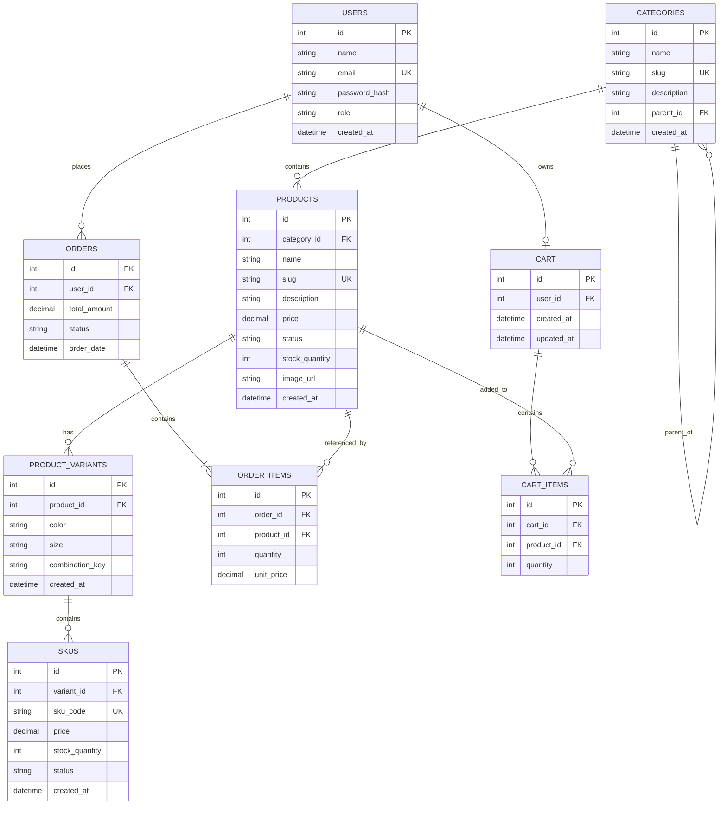

# StyleCart — Sprint 2: Catalog Data Foundation

**Course:** E-Commerce
**Department:** Computer Science / Artificial Intelligence
**Project Type:** Individual E-Commerce Project
**Domain:** Fashion & Accessories
**Sprint:** 2 - Catalog Data Foundation

---

## 1. Sprint Objective

The objective of Sprint 2 is to establish a reliable catalog data foundation for StyleCart.

This sprint focuses on:

* Product and category management
* Category hierarchy
* Product variants
* SKU management
* Stock and price validation
* Authenticated admin APIs
* Database relationships
* Seed/demo catalog data
* Automated API validation tests

---

## 2. Catalog Structure

StyleCart uses a hierarchical product catalog.

### Category Tree

```text
Clothing
└── Men's Clothing
```

### Categories

| ID | Category       | Parent Category |
| -: | -------------- | --------------- |
|  1 | Clothing       | None            |
|  2 | Men's Clothing | Clothing        |

The category structure demonstrates a two-level category hierarchy.

---

## 3. Product Catalog

The StyleCart catalog contains three products.

| ID | Product         | Category | Status |
| -: | --------------- | -------- | ------ |
|  1 | Classic T-Shirt | Clothing | Active |
|  2 | Denim Jeans     | Clothing | Active |
|  3 | Casual Shirt    | Clothing | Active |

The Denim Jeans product is used to demonstrate multiple product variants and SKUs.

---

## 4. Product Variants

The Denim Jeans product contains multiple combinations of color and size.

| Variant ID | Product     | Color | Size | Combination Key |
| ---------: | ----------- | ----- | ---- | --------------- |
|          2 | Denim Jeans | Blue  | 32   | Blue-32         |
|          3 | Denim Jeans | Blue  | 34   | Blue-34         |
|          4 | Denim Jeans | Black | 32   | Black-32        |
|          5 | Denim Jeans | Black | 34   | Black-34        |

These variants allow the same product to have different selectable combinations.

---

## 5. SKU Data

Four SKUs were created for the Denim Jeans product.

| SKU ID | SKU Code       | Price | Stock Quantity | Status      |
| -----: | -------------- | ----: | -------------: | ----------- |
|      2 | DENIM-BLUE-32  |  2999 |             20 | Available   |
|      3 | DENIM-BLUE-34  |  2999 |             15 | Available   |
|      4 | DENIM-BLACK-32 |  2999 |             12 | Available   |
|      5 | DENIM-BLACK-34 |  2999 |              0 | Unavailable |

The `DENIM-BLACK-34` SKU demonstrates an unavailable product combination because its stock quantity is zero.

---

## 6. Admin API Endpoints

StyleCart provides authenticated admin APIs for catalog management.

### Authentication

```text
POST /api/v1/auth/login
```

### Categories

```text
POST /api/v1/admin/categories
GET /api/v1/admin/categories
```

### Products

```text
POST /api/v1/admin/products
PATCH /api/v1/admin/products/:id
GET /api/v1/admin/products
```

### Product Variants

```text
POST /api/v1/admin/products/:id/variants
```

### SKUs

```text
POST /api/v1/admin/products/:id/skus
GET /api/v1/admin/products/:id/skus
PATCH /api/v1/admin/skus/:id
```

---

## 7. Authentication and Authorization

All admin catalog routes are protected using authentication and admin authorization.

The basic authentication flow is:

```text
Admin Login
    |
    v
JWT Token
    |
    v
Bearer Authorization
    |
    v
Admin Catalog API
```

A valid administrator token is required to access the admin catalog endpoints.

Requests without authentication are rejected by the API.

---

## 8. Data Validation

The system performs validation before creating or updating catalog records.

### Category Validation

* Category name is required.
* Category slug is required.
* Parent category must exist when a parent is specified.
* Category slug must be unique.

### Product Validation

* Product name is required.
* Product slug is required.
* Category must exist.
* Product slug must be unique.
* Product status is validated.

### Variant Validation

* Variant option values are required.
* Combination key is required.
* Duplicate variant combinations for the same product are rejected.

### SKU Validation

* SKU code is required.
* SKU code must be unique.
* Variant must belong to the selected product.
* Price cannot be negative.
* Stock quantity cannot be negative.

These validations help maintain reliable and consistent catalog data.

---

## 9. Database Relationships

The catalog follows a relational structure.

```text
CATEGORIES
     |
     +------< CATEGORIES
     |        (Parent-Child)
     |
     +------< PRODUCTS
                |
                +------< PRODUCT_VARIANTS
                             |
                             +------< SKUs
```

The main relationships are:

* A category can contain multiple products.
* A category can have child categories.
* A product belongs to a category.
* A product can contain multiple variants.
* A variant belongs to a product.
* A variant can have multiple SKUs.
* Each SKU stores price, stock quantity and status.
* Orders are associated with users.
* Order items are associated with products.
* Cart items are associated with products.

---

## 10. Sprint 2 Catalog ERD

The following ERD represents the main StyleCart database entities and their relationships.



### ERD Explanation

* `USERS` stores customer and administrator accounts.
* `CATEGORIES` stores product categories and supports parent-child hierarchy through `parent_id`.
* `PRODUCTS` stores the main catalog products.
* `PRODUCT_VARIANTS` stores selectable product combinations such as color and size.
* `SKUS` stores unique stock keeping units with their price, stock quantity and status.
* `ORDERS` stores customer orders.
* `ORDER_ITEMS` stores the products included in each order.
* `CART` stores a user's shopping cart.
* `CART_ITEMS` stores products added to the cart.

The ERD provides the database foundation for the StyleCart catalog and future shopping functionality.

---

## 11. Catalog Data Demonstration

The implemented catalog demonstrates the required data foundation.

### Categories

```text
Clothing
└── Men's Clothing
```

### Products

```text
1. Classic T-Shirt
2. Denim Jeans
3. Casual Shirt
```

### Denim Jeans Variants

```text
Blue-32
Blue-34
Black-32
Black-34
```

### Denim Jeans SKUs

```text
DENIM-BLUE-32  -> Stock: 20
DENIM-BLUE-34  -> Stock: 15
DENIM-BLACK-32 -> Stock: 12
DENIM-BLACK-34 -> Stock: 0 (Unavailable)
```

---

## 12. Automated Testing

Automated API tests were implemented using Jest.

### Test File

```text
backend/tests/sprint2.test.js
```

The test suite verifies catalog retrieval, validation and authorization scenarios.

### Test Cases

|  # | Test Case                                 | Result |
| -: | ----------------------------------------- | ------ |
|  1 | Admin can retrieve categories             | PASS   |
|  2 | Admin can retrieve products               | PASS   |
|  3 | Admin can retrieve Denim Jeans SKUs       | PASS   |
|  4 | Duplicate category slug is rejected       | PASS   |
|  5 | Invalid parent category is rejected       | PASS   |
|  6 | Duplicate SKU code is rejected            | PASS   |
|  7 | Negative stock is rejected                | PASS   |
|  8 | Negative price is rejected                | PASS   |
|  9 | Unauthenticated admin request is rejected | PASS   |

### Test Command

```bash
npm test
```

### Test Result

```text
Test Suites: 1 passed, 1 total
Tests:       9 passed, 9 total
Snapshots:   0 total
Time:        0.811 s
```

All 9 implemented automated tests passed successfully.

---

## 13. Validation Test Examples

### Duplicate Category Slug

The system rejects a category when its slug already exists.

```text
Result: PASS
Expected Status: 409 Conflict
```

### Invalid Parent Category

The system rejects a category when the specified parent category does not exist.

```text
Result: PASS
Expected Status: 400 Bad Request
```

### Duplicate SKU Code

The system rejects a SKU when the SKU code already exists.

```text
Result: PASS
Expected Status: 409 Conflict
```

### Negative Stock

The system rejects a SKU with a negative stock quantity.

```text
Result: PASS
Expected Status: 400 Bad Request
```

### Negative Price

The system rejects a SKU with a negative price.

```text
Result: PASS
Expected Status: 400 Bad Request
```

### Unauthorized Request

The system rejects an admin API request when no authentication token is provided.

```text
Result: PASS
Expected Status: 401 Unauthorized
```

---

## 14. Sprint 2 Admin Workflow

The catalog management workflow is:

```text
Admin Login
    |
    v
Create Category
    |
    v
Create Child Category
    |
    v
Create Product
    |
    v
Create Product Variants
    |
    v
Create SKUs
    |
    v
Update Product or SKU
    |
    v
Retrieve Catalog Records
```

This workflow provides the foundation for future customer-facing catalog and shopping features.

---

## 15. Sprint 2 Deliverables

The following Sprint 2 components have been implemented:

* [x] Category management
* [x] Two-level category hierarchy
* [x] Product management
* [x] Product variants
* [x] SKU management
* [x] Stock validation
* [x] Price validation
* [x] Duplicate category slug validation
* [x] Duplicate SKU validation
* [x] Admin authentication
* [x] Admin authorization
* [x] Catalog retrieval APIs
* [x] Seed/demo catalog data
* [x] Four valid SKUs
* [x] One unavailable SKU combination
* [x] Sprint 2 Catalog ERD
* [x] Jest automated tests
* [x] 9/9 automated tests passing

---

## 16. Conclusion

Sprint 2 establishes the catalog data foundation for StyleCart.

The system supports authenticated administration of categories, products, product variants and SKUs. The catalog contains a two-level category hierarchy, three products, multiple product variants, four SKUs and one intentionally unavailable SKU.

Validation rules are implemented to reject duplicate category slugs, duplicate SKU codes, invalid parent categories, negative stock and negative prices.

The Sprint 2 database ERD documents the relationships between users, categories, products, variants, SKUs, orders and carts.

The automated Jest test suite contains 9 tests, and all 9 tests passed successfully.

Sprint 2 therefore provides the required catalog foundation for the upcoming StyleCart development sprints.
